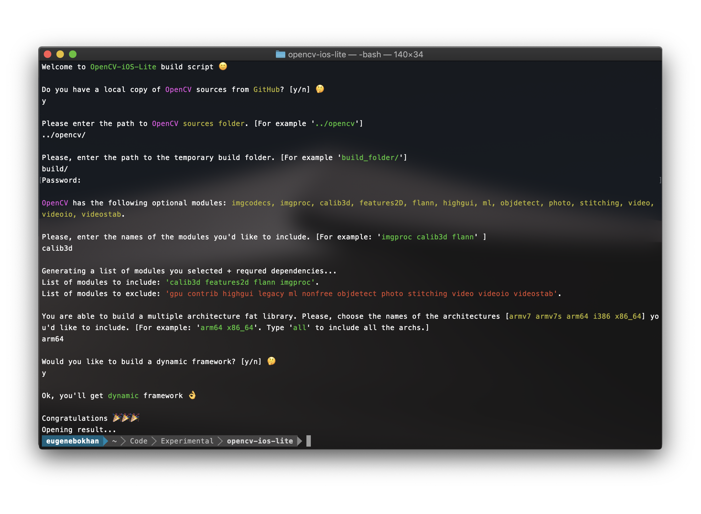

# OpenCV iOS Light Superbuild

This script will help you to build your own custom light version of OpenCV for iOS 🙂

## Features

* Easy-to-use
* Automatic download of OpenCV sources if needed
* Choose necessary `modules`
* Choose necessary `architectures`
* Build `static / dynamic` version

<p align="center">
    
</p>

## Requirements

* Xcode 9 or later
* CMake

## How To Use

```shell
git clone https://github.com/eugenebokhan/OpenCV-iOS-Light-Superbuild.git && cd OpenCV-iOS-Light-Superbuild/Code/
./build_opencv_ios_lite.sh
```

## OpenCV Modules Info

* **imgcodecs** - Image file reading and writing.
This module of the OpenCV help you read and write images to/from disk or memory.

* **calib3d** - Camera Calibration and 3D Reconstruction.
The functions in this section use a so-called pinhole camera model. In this model, a scene view is formed by projecting 3D points into the image plane using a perspective transformation.

* **features2D** - 2D Features Framework.
This section describes approaches based on local 2D features and used to categorize objects.

* **flann** - Fast Approximate Nearest Neighbor Search Library.
This section documents OpenCV's interface to the FLANN library. FLANN is a library that contains a collection of algorithms optimized for fast nearest neighbor search in large datasets and for high dimensional features.

* **highgui** - High-level GUI and Media I/O.
While OpenCV was designed for use in full-scale applications and can be used within functionally
rich UI frameworks (such Cocoa) or without any UI at all, sometimes there it is required to try functionality quickly and visualize the results. This is what the HighGUI module has been designed for.

* **ml** - Machine Learning.
The Machine Learning Library (MLL) is a set of classes and functions for statistical classification, regression, and clustering of data.

* **photo** - Computational Photography.
This section describes high dynamic range imaging algorithms namely tonemapping, exposure alignment, camera calibration with multiple exposures and exposure fusion.

* **objdetect** - Object Detection.
Haar Feature-based Cascade Classifier for Object Detection.

* **stitching** - Images Stitching.

* **video** - Video Analysis.
Video stream algorithms like: motion extraction, feature tracking and foreground extractions.

* **videoio** - Video Input and Output.
Read and write video streams, calculate similarity values such as PSNR or SSIM.

* **videostab** - Video Stabilization.
The video stabilization module contains a set of functions and classes that can be used to solve the problem of video stabilization.


## Author
| [](https://github.com/eugenebokhan)   | [Eugene Bokhan](https://github.com/eugenebokhan)<br/><br/><sub>iOS Software Engineer</sub><br/> [![Twitter][1.1]][1] [![Github][2.1]][2] [![LinkedIn][3.1]][3]|
| - | :- |

[1.1]: http://i.imgur.com/wWzX9uB.png (twitter icon without padding)
[2.1]: http://i.imgur.com/9I6NRUm.png (github icon without padding)
[3.1]: https://www.kingsfund.org.uk/themes/custom/kingsfund/dist/img/svg/sprite-icon-linkedin.svg (linkedin icon)

[1]: https://twitter.com/eugenebokhan
[2]: https://github.com/eugenebokhan
[3]: https://www.linkedin.com/in/eugenebokhan/

## License

[Project's license](LICENSE) is based on the BSD 3-Clause.
